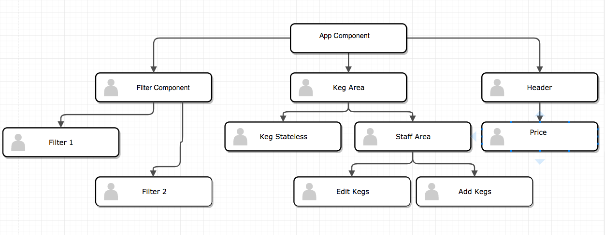
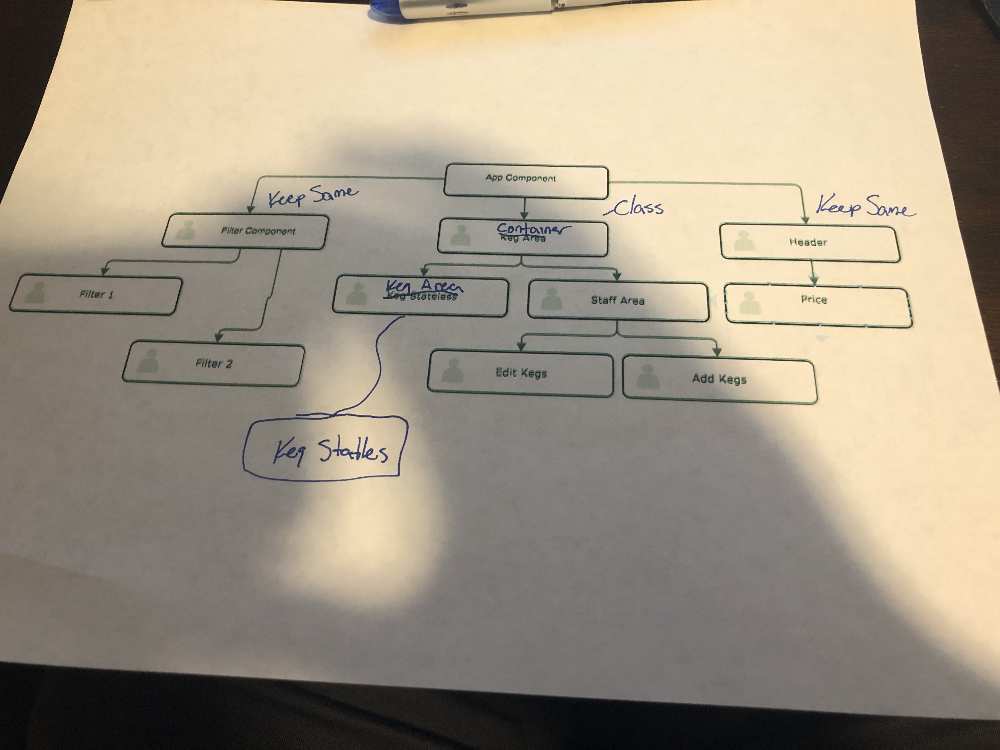

Build Component Diagram

## Synopsis

This is my React Project that is a recreation of an Angular Project at Epicodus.

## Code Example

This project allows you to see what kegs are available and sell beers from them using buttons.

## Installation

Enter The Following Commands in Terminal
 * cd desktop
 * git clone https://github.com/SamKissee/React-Taproom.git project
 * cd project
 * npm install
 * webpack
 * npm run start
  then open https://localhost:8080

## Notes

  Transferring over the project between Angular and React was a bit different than expected. I used bootstrap in the original project and had not yet learned how to implement that in React. That will be a further exploration thing. I also used a lot more components in this project than in angular.

  At this point angular seems easier to use mostly because I was using the CLI by this point in Angular and learning the setup of a new library and new packager can be strange.

## Creators
 Created by Sam Kissee 2018
